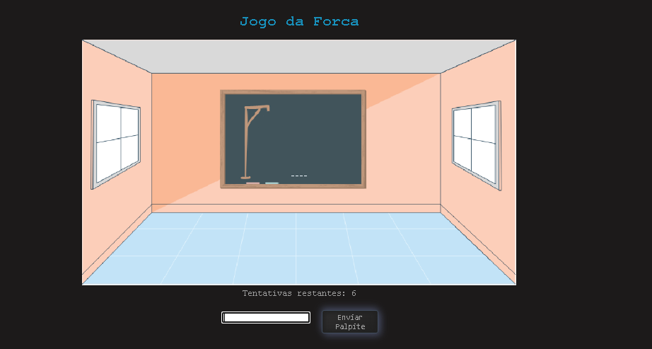

# Jogo da Forca

Um jogo da forca simples desenvolvido com HTML, CSS e JavaScript

## Descrição

O Jogo da Forca é um jogo em que o jogador deve adivinhar uma palavra oculta, inserindo letras como palpites. A cada letra incorreta, uma parte do boneco da forca é desenhada. O objetivo do jogo é adivinhar a palavra antes que o boneco seja totalmente desenhado.

## Funcionalidades

- Seleção aleatória de palavras para adivinhar;
- Exibição de underscores representando as letras da palavra a serem adivinhadas;
- Contagem regressiva das tentativas restantes;
- Verificação dos palpites do jogador;
- Exibição da imagem da forca, desenhando o boneco progressivamente a cada erro;
- Reinicialização do jogo após vitória ou derrota;

## Tecnologias utilizadas

- HTML
- CSS
- JavaScript

## Como executar

1. Faça o clone deste repositório.
2. Abra o arquivo index.html em um navegador web.
3. Comece a jogar! Insira letras no campo de entrada e clique em "Enviar Palpite".

## Screenshots

